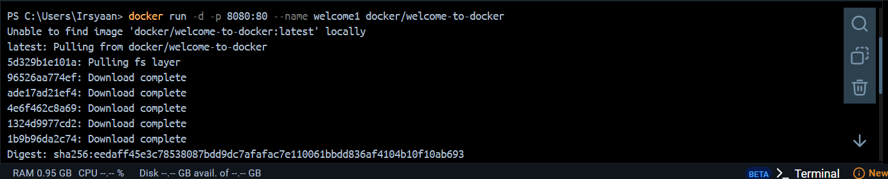
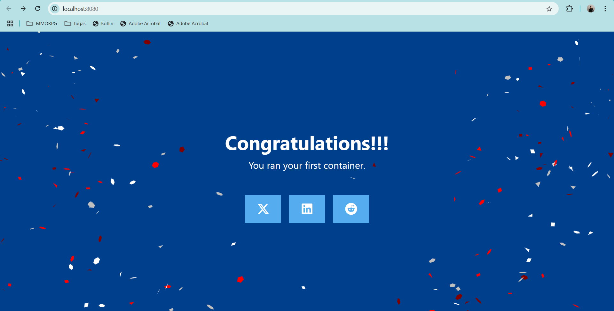
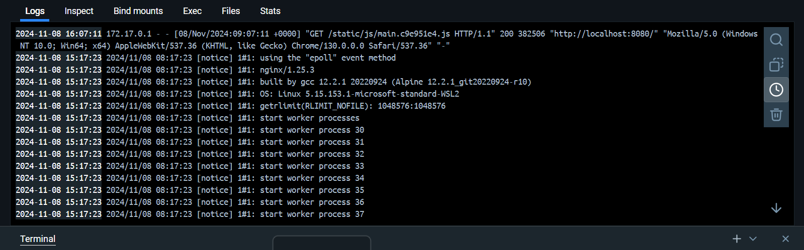
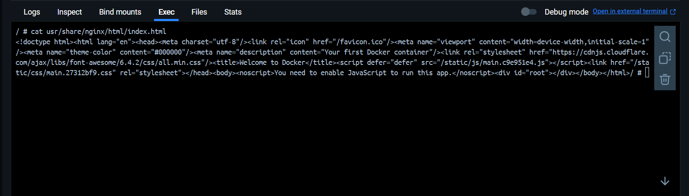
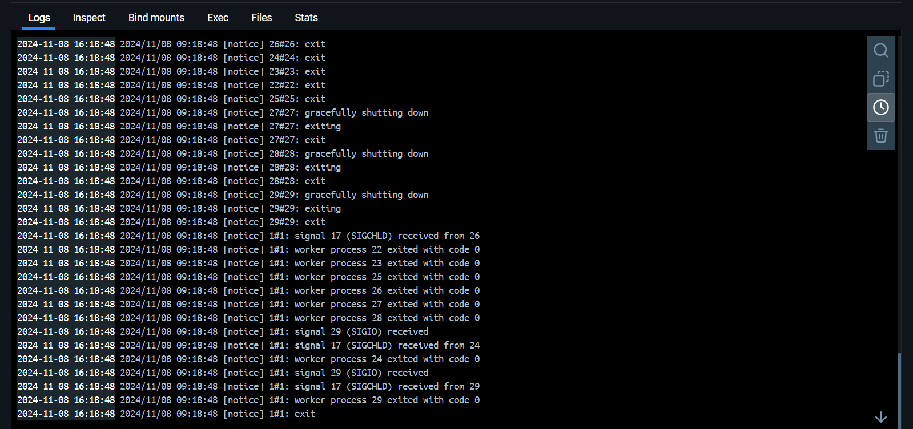

# Run Existing Docker Image as a Container

### Run container baru dengan nama 'welcome1'

### Mencoba buka di browser dengan localhost

### Melihat Log dari Container

### Execute command cat untuk melihat index.html

### Stop Container
